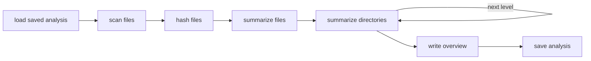
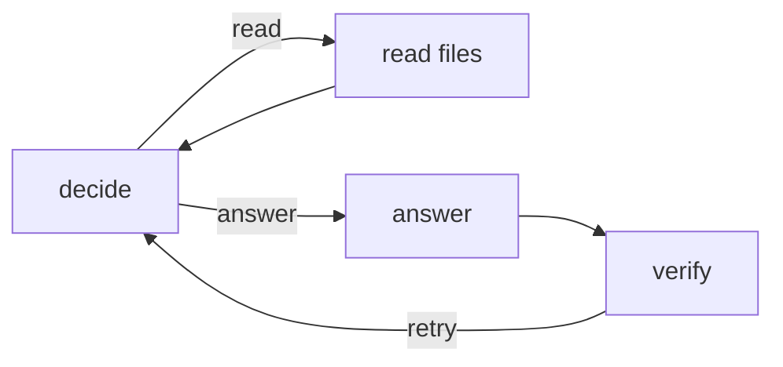

# jones

Git repo explorer (now with AI✨)

jones is a terminal app for getting to know unfamiliar codebases. Clone a repo, let jones summarize it, then ask questions about it. Answers cite the lines of code they come from, and are checked against that code before they're shown.

- **Responsive terminal UI** built with [Bubble Tea](https://github.com/charmbracelet/bubbletea). Anything slow runs in the background with live progress, answers stream in as they're written, and esc cancels whatever is running.
- **Parallel analysis.** jones summarizes every file, then every directory from the deepest up, then the whole repo, running the model calls in each step at the same time. Running it again only redoes what changed.
- **Grounded answers.** An agent uses the summaries to pick which files to read, then answers only from their code, citing `path:line` for each claim. The citations are checked against the lines it read, the model checks that the cited code backs up each claim, and an answer that fails is redone.
- **Resilient API calls.** A retry library with constant, exponential, Fibonacci, and custom backoff, jitter, and delays requested by the server, plus client side rate limiting.

## Getting started

You need Go 1.23 or newer, git, and a [Gemini API key](https://ai.google.dev/gemini-api/docs/api-key).

```bash
git clone https://github.com/ansht2000/jones
cd jones
echo "GEMINI_API_KEY=your-key" > .env
go run .
```

Then, inside jones:

```
clone https://github.com/charmbracelet/bubbletea
analyze bubbletea
How does Bubble Tea run commands without blocking the UI?
```

Anything that isn't a command is asked as a question about the repo in use.

### Commands

| Command | What it does |
|---|---|
| `clone <repo_url>` | Clones a git repo from an https or ssh URL |
| `list` | Lists the cloned repos, and which have been analyzed |
| `analyze <repo_name>` | Summarizes a repo so you can ask about it, rerun it to catch up on changes |
| `use <repo_name>` | Picks the analyzed repo to ask questions about |
| `ask <question>` | Asks a question about the repo in use |
| `tree <repo_name>` | Writes the repo's file tree as JSON and as text |
| `clear` | Clears the screen |
| `help` | Lists the commands |
| `quit` | Quits jones |

| Key | What it does |
|---|---|
| up, down, pgup, pgdn | Scroll |
| esc | Cancel what's running, or clear the input |
| ctrl+c | Quit |

### Configuration

| Variable | Default | What it's for |
|---|---|---|
| `GEMINI_API_KEY` or `GOOGLE_API_KEY` | | Your Gemini API key, which can also go in `.env` |
| `JONES_MODEL` | `gemini-2.5-flash` | The Gemini model to use |
| `JONES_RPM` | no limit | Most requests to send per minute, for API tiers with low rate limits |
| `REPO_ROOT` | `<data dir>/jones/repos` | Where repos are cloned |
| `TREE_ROOT` | `<data dir>/jones/trees` | Where `tree` writes JSON trees |
| `ANALYSIS_ROOT` | `<data dir>/jones/analysis` | Where analyses are saved |

The data directory follows the XDG spec, `~/.local/share` on Linux. Logs go to `~/.local/state/jones/jones.log` on Linux, since the UI takes over the terminal.

## How it works

The pipelines are built on `actorflow`, a Go port of [PocketFlow](https://github.com/The-Pocket/PocketFlow). It was originally intended to use the actor model as well, but I changed my mind because PocketFlow's simple architecture did not require it. Each node reads what it needs from a shared store (prep), does its work without touching the store (exec), and writes back its results and picks the next node (post). Batch nodes run exec for many items at once, which is safe because exec never sees the store.

### Analyzing a repo



- **scan** lists the files git tracks, so build output and anything in `.gitignore` is left out, along with directories like `node_modules` and `vendor`.
- **hash** fingerprints every file in parallel. Binaries, lockfiles, minified files, and symlinks aren't sent to the model, and symlinks are never followed, so a repo can't get a file from outside it read.
- **summarize files** asks the model for each file's purpose, key symbols, and dependencies, with many calls at once.
- **summarize directories** runs once per level of the tree, deepest first, summarizing each directory from its children's summaries. Directories on the same level are summarized at once.
- **save** keeps each file's hash and each directory's hash, which is built from its children's like a git tree. The next run only redoes files whose contents changed and the directories above them.

### Answering a question



- **decide** sees the question, the overview, every file with its summary and key symbols, and the files read so far, and chooses up to 5 more files to read or to answer.
- **read** only reads files from the analysis. Made up paths, paths outside the repo, and binaries are refused, and the agent is told why.
- **answer** streams an answer that may only use the code that was read, citing `path:line` for each claim.
- **verify** checks that every citation points at lines that were read, then has the model check that the cited code backs up each claim. A failed answer goes back to decide once, with the problems listed.

### Code

| Package | What's in it |
|---|---|
| `.` | The TUI and its commands |
| `internal/actorflow` | The PocketFlow port: nodes, batch nodes, and flows |
| `internal/retry` | The retry library |
| `internal/llm` | The Gemini client, prompts, and a mock for tests |
| `internal/analysis` | Analyzing repos |
| `internal/agent` | Answering questions |
| `internal/repo` | Cloning and scanning repos |
| `internal/eval`, `cmd/eval` | The evaluation |

## Performance

`make bench` analyzes a repo of 64 files in 8 directories, 73 model calls, with a simulated model that takes 20ms per call. On an AMD Ryzen 7 7700:

| Model calls at once | Time | Speedup |
|---|---|---|
| 1 | 1479 ms | 1x |
| 4 | 386 ms | 3.8x |
| 16 (the default) | 124 ms | 12x |
| 64 | 63 ms | 23.5x |
| Analyzing it again with nothing changed | 1.4 ms, no model calls | |

Real calls take longer than 20ms, which scales every time up but leaves the speedups about the same, until the API's rate limits get in the way. `make eval` times real analyses with the Gemini API.

## Evaluation

`make eval` asks 20 questions about pinned versions of three Go repos, [godotenv](https://github.com/joho/godotenv) v1.5.1, [x/time](https://pkg.go.dev/golang.org/x/time) v0.6.0, and [Bubble Tea](https://github.com/charmbracelet/bubbletea) v1.3.6. Each question in [`eval/questions.json`](eval/questions.json) comes with a reference answer written from the code, the phrases a correct answer has to mention, and the files that hold the answer. Three ways of answering are compared:

- **baseline**: one call with the repo's overview and file summaries, like a tool that never reads the code
- **agent**: jones' agent, keeping its first answer without checking it
- **agent + verify**: jones' agent as it normally runs

Each answer is scored on whether a model judge finds it agrees with the reference, whether it mentions the key facts, whether its citations point at lines that exist, and how long it took. The report is saved to `eval/results.md`, with the raw results in `eval/results.json`.

```bash
go run ./cmd/eval -dry-run
```

checks the setup and estimates the number of API calls without making any, about 300 for the whole evaluation.

## Development

```bash
make test       # unit tests, no API key needed
make bench      # the benchmark above
make test-live  # tests that call the Gemini API
make eval       # the evaluation
```
